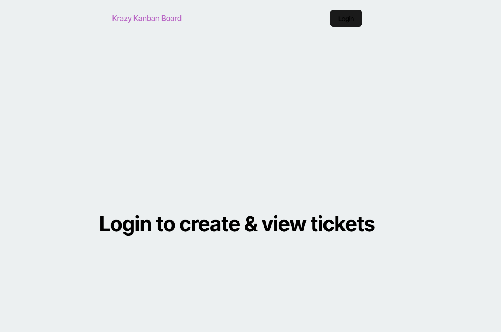
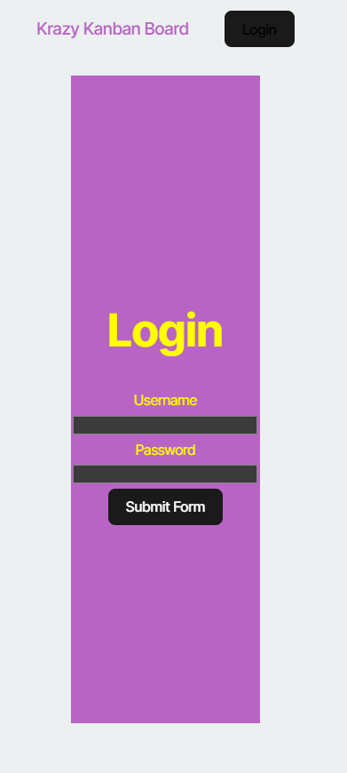

# kanBan ticket board

This application utilizes React with JWT authentication to access a KanBan board

[deployed app](https://reactjwt.onrender.com/login)

## Table of Contents
- [Installation](#installation)
- [Usage](#usage)
- [Contributing](#contributing)
- [Tests](#tests)
- [Questions](#questions)

## Installation

## Usage

## Contributing
Please create your own branch

## Tests

## Questions

If you have any questions, please reach out to me at 
[jensenbret13@gmail.com](mailto:jensenbret13@gmail.com).
GitHub: [bretaj](https://github.com/bretaj)
